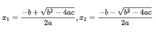

**UNIVERSIDADE LUSÓFONA DE HUMANIDADES E TECNOLOGIAS**

*Linguagens de Programação I*

# Exercício 1

Este exercício serve os seguintes objectivos:
- Utilização de alguns operadores
- Utilização de variáveis
- Utilização de condições simples

Na resolução destes exercícios deve ser utilizada a Linguagem de Programação C. Para além da correta implementação dos requisitos, tenha em conta os seguintes aspetos:
- O código apresentado deve ser bem indentado. 
- O código deve compilar sem erros ou *warnings* utilizando o *gcc* com as seguintes flags:
- `-g -Wvla -Wall -Wpedantic -Wextra -Wdeclaration-after-statement`
- Pode, e deve, utilizar a biblioteca `<math.h>`. Para isso terá de incluir nas flags de linkagem a flag `-lm`. Se desenvolver utilizando o Replit, poderá simplesmente fazer fork do projecto https://replit.com/@PedroSerra/FirstProgramInC pois esse projecto já está configurado para compilar com essa flag. Se utiliza outra ferramenta a considere que compilação deverá ser feita da seguinte forma, assumindo que o ficheiro de source tem o nome `main.c`:
  `gcc -g -Wvla -Wall -Wpedantic -Wextra -Wdeclaration-after-statement main.c -o main -lm`
- Tenha em atenção os nomes dados das variáveis, para que sejam indicadores daquilo que as mesmas vão conter.
- O trabalho deve ser desenvolvido e submetido de forma individual.

Este exercício deverá ser submetido na plataforma Pandora até às 23:59 do dia 13/3/2022 e será contabilizado para a nota final da unidade curricular de acordo com os critérios disponibilizados na página da disciplina, concretamente nos slides da primeira aula.


## Descrição

Crie um programa que calcula as raizes do polinómio:


onde os coeficientes `a`, `b` e `c` podem tomar qualquer valor, incluindo zero. Recorde que, nos casos em que `a != 0`, há duas soluções possíveis dadas pela conhecida fórmula resolvente:



E o resultado pode ser real ou complexa (imaginária) dependendo do valor do termo dentro da raiz quadrada.

Por outro lado, se `a` for igual a zero, há apenas uma solução possível e se `a` e `b` forem ambos zero, não faz sentido efectuar qualquer cálculo.

### Detalhes de implementação

Crie um programa que começa por pedir ao utilizador que insira os valores dos coeficientes `a`, `b` e `c`. Para isso deve imprimir a mensagem

```"Insira os coeficientes a, b e c:\n"```

Em seguida faz os calculos necessários para apresentar o resultado. 

- Caso o resultado tenha apenas um valor, deverá imprimir a seguinte mensagem:

```x1 = <valor>\n```

onde `<valor>` é o resultado apresentado com duas  casas decimais.

- Caso o resultado tenha duas soluções (mesmo que estas sejam iguais) deverá imprimir a seguinte mensagem:

```x1 = <valor1>, x2 = <valor2>\n```

onde `<valor1>` é o valor obtido usando a fórmula resolvente com o sinal `+` e `<valor2>` é o valor obtido usando a fórmula resolvente com o sinal `-` - ambos apresentados com duas casas decimais. Caso o resultado pertença ao conjunto de números imaginários, o resultado deve ser apresentado da seguinte forma:

```x1 = <real> + <imaginario>i, x2 = <real> - <imaginario>i\n```

onde `<real>` é a parte real do resultado obtido e <imaginario> é a parte imaginária do resultado obtido, ambos apresentados com duas casas decimais.

  
- Caso o resultado seja impossível, ou não faça sentido, o programa deve apresentar a mensagem:

```Solucao Impossivel\n```

O programa termina após apresentação do resultado.
  
### Exemplos de utilização:

```
Insira os coeficientes a, b e c:
0 0 1
Solucao Impossivel
```
  
```
Insira os coeficientes a, b e c:
10 20 1
x1 = -0.05, x2= -1.95
```  

```
Insira os coeficientes a, b e c:
1 1 50
x1 = -0.50 + 7.05i, x2 = -0.50 -7.05i
```  
  
  
## Honestidade Académica

Nesta disciplina, espera-se que cada aluno siga os mais altos padrões de honestidade académica. Trabalhos que sejam identificados como cópias serão anulados e os alunos envolvidos terão nota zero - quer tenham copiado, quer tenham deixado copiar.
Para evitar situações deste género, recomendamos aos alunos que nunca partilhem ou mostrem o seu código.
A decisão sobre se um trabalho é uma cópia cabe exclusivamente aos docentes da unidade curricular.
Os alunos são encorajados a discutir os problemas com outros alunos mas não deverão, no entanto, copiar códigos, documentação e relatórios de outros alunos. Em nenhuma circunstância deverão partilhar os seus próprios códigos, documentação e relatórios. De facto, não devem sequer deixar códigos, documentação e relatórios em computadores de uso partilhado.

